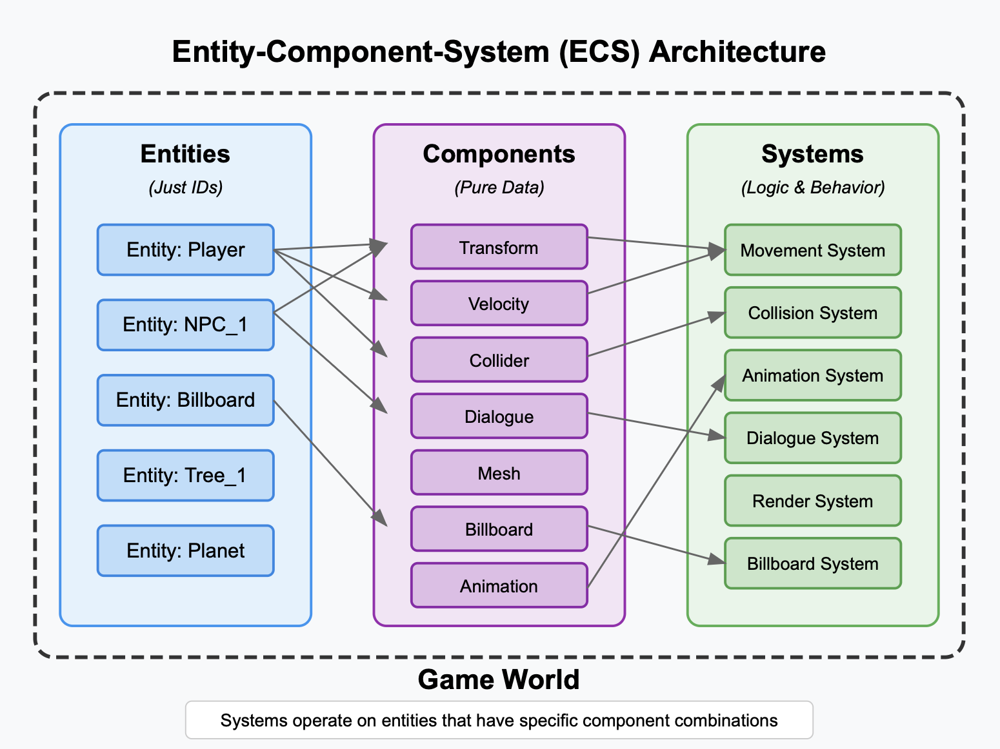

# Game Architecture

## Overview

This document outlines the Component-Entity-System (CES) architecture for our 3D game engine.
Please keep in mind that this is what we aim for, not what we have at the moment as of Mar 6 2025.

## Development Phases

### Phase 1: Core Functionality

- Minimum Viable Product
- Simple rendering and movement
- Collision detection
- Pre-scripted NPC interactions

### Phase 2: Foundational optimization

- To be done

### Phase 3: Enhanced Graphics and User Customization

- To be done

### Phase 4: Advanced Interactions

- To be done

### Phase 5: AI Integration

- To be done

## Core Architecture

### 1. Entities

Base game objects that serve as containers for components.

```typescript
// Example structure
/src
  /entities
    /base
      Entity.ts       // Base entity class
    Character.ts      // Player character entity
    NPC.ts           // Non-player character entity
    Billboard.ts     // Interactive billboard entity
```

### 2. Components

Reusable modules that define specific behaviors or properties.

```typescript
/src
  /components
    /physics
      Transform.ts    // Position, rotation, scale
      Collider.ts    // Collision detection
      Velocity.ts    // Movement properties
    /rendering
      Mesh.ts        // 3D model representation
      Material.ts    // Visual properties
    /input
      KeyboardInput.ts
      TouchInput.ts
    /behavior
      Movement.ts    // Movement behavior
      Interaction.ts // Interactive behavior
```

### 3. Systems

Logic that operates on entities with specific components.

```typescript
/src
  /systems
    PhysicsSystem.ts    // Handles physics calculations
    RenderSystem.ts     // Manages rendering
    InputSystem.ts      // Processes input
    CollisionSystem.ts  // Handles collision detection
    AnimationSystem.ts  // Manages animations
```

## Project Structure

```typescript
/src
  /core
    /ecs
      types.ts              // Core ECS type definitions
      componentFactory.ts   // Component creation utilities
      entityManager.ts      // Entity management
      systemManager.ts      // System management
      world.ts              // Game world state
    /engine
      Game.tsx              // React entry point
      GameLoop.ts           // Main game loop
      Time.ts               // Time management
      Scene.ts              // Three.js scene management
      Camera.ts             // Camera controls and management
      Input.ts              // Input handling (keyboard, mouse, touch)

  /components
    /physics
      transform.ts          // Position, rotation, scale
      collider.ts           // Collision detection
      velocity.ts           // Movement properties
    /character
      player.ts             // Player-specific properties
      npc.ts                // NPC-specific properties
      animation.ts          // Character animations
    /interaction
      interactable.ts       // Interactive object properties
      dialogue.ts           // Conversation system properties
      trigger.ts            // Interaction trigger zones
    /ui
      billboard.ts          // Portfolio billboard properties
      hud.ts                // HUD elements
      virtualKeyboard.ts    // Mobile controls

  /systems
    /physics
      movement.ts           // Character movement
      collision.ts          // Collision handling
    /character
      playerControl.ts      // Player input handling
      npcBehavior.ts        // NPC behavior and pathfinding
      animation.ts          // Animation management
    /interaction
      dialogue.ts           // Dialogue system
      trigger.ts            // Interaction detection
    /ui
      billboardUpdate.ts    // Portfolio content management
      hudUpdate.ts          // HUD updates
      virtualKeyboard.ts    // Mobile input processing

  /ui                       // React UI Components
    /components
      DialogueBox.tsx       // Conversation interface
      Portfolio.tsx         // Portfolio content display
      VirtualKeyboard.tsx   // Mobile controls
      GameHUD.tsx           // Game interface elements
    /controls
      Button.tsx            // Reusable button component
      Joystick.tsx          // Mobile movement control
    /theme                  // UI styling and theming
      colors.ts             // Color palette
      typography.ts         // Text styling
      animations.ts         // UI animations

  /data
    /dialogue               // Pre-scripted conversations
      introNPC.json
      portfolioNPC.json
      skillsNPC.json
    /portfolio              // Portfolio content
      resume.json
      projects.json
      skills.json
    /world                  // World configuration
      objects.json          // Static object placement
      npcs.json             // NPC placement and properties

  /assets
    /models                 // 3D models
      /characters
        player.glb
        npc.glb
      /environment
        planet.glb
        trees.glb
    /textures               // Textures and materials
    /animations             // Character animations
    /sounds                 // Sound effects and music
    /placeholders           // Placeholder assets for development

  /utils
    math.ts                 // Math utilities
    debug.ts                // Debugging utilities
    events.ts               // Event system

  /services                 // Service-oriented functionality
    assetLoader.ts          // Centralized asset loading
    persistenceService.ts   // Save/load game state
    analyticsService.ts     // Usage tracking (optional)
    audioService.ts         // Sound management

  /repositories             // Data access layer
    dialogueRepository.ts   // Loading dialogue data
    portfolioRepository.ts  // Loading portfolio content
    worldRepository.ts      // Loading world configuration

  /config                   // Game configuration
    game.ts                 // General game settings
    physics.ts              // Physics settings
    graphics.ts             // Graphics settings
    audio.ts                // Audio settings
    constants.ts            // Game constants

  /state                    // Game state management
    gameState.ts            // Global game state
    persistentState.ts      // Saved game state
    contextState.ts         // Conversation context

  /ai                       // Future NLP integration
    /dialogue
      nlpProcessor.ts       // Natural language processing
      responseGen.ts        // Response generation
      contextManager.ts     // Conversation context tracking

  /types                    // TypeScript type definitions
    game.d.ts
    components.d.ts
    systems.d.ts
    services.d.ts
    repositories.d.ts

  /hooks                    // Custom React hooks
    useGameInput.ts         // Input handling
    useGameState.ts         // Game state access
    useAssets.ts            // Asset loading
```

### Key Directories

#### /core

Contains the fundamental game engine architecture and ECS implementation.

#### /components

Houses all component definitions, organized by functionality.

#### /systems

Contains all system implementations, grouped by domain.

#### /entities

Stores entity definitions and factory methods.

#### /ui

React components for game interface elements.

#### /utils

Helper functions and utility classes.

#### /config

Game configuration and constants.

#### /assets

Asset management and loading.

#### /types

TypeScript type definitions and interfaces.

### File Naming Conventions

- Components: `*Component.ts`
- Systems: `*System.ts`
- React Components: `*.tsx`
- Utilities: `*.ts`
- Configuration: `*Config.ts`

### Import Structure

```typescript
// Core imports
import { Entity, Component, System } from "@core/ecs";
import { Game } from "@core/engine";

// Component imports
import { TransformComponent } from "@components/physics";
import { MeshComponent } from "@components/rendering";

// System imports
import { MovementSystem } from "@systems/physics";
import { RenderSystem } from "@systems/rendering";

// Entity imports
import { Character } from "@entities/prefabs";

// UI imports
import { GameHUD } from "@ui/components";
```

This structure promotes:

- Clear separation of concerns
- Easy location of related code
- Scalable architecture
- Maintainable codebase
- Clear dependencies

## Data Flow

1. Systems query for entities with specific component combinations
2. Systems process components and update entity state
3. Changes propagate through relevant systems
4. Render system updates visual representation

## Key Concepts

### Entity Composition

- Entities are composed of multiple components
- No inheritance hierarchy for entities
- Components define behavior and properties

### Component Design

- Components are pure data containers
- No behavior logic in components
- Components can depend on other components

### System Responsibility

- Systems contain all game logic
- Systems operate on component combinations
- Systems are independent and focused

## Performance Considerations

- Component pools for memory management
- System execution order optimization
- Spatial partitioning for physics/collision
- Component data alignment for cache efficiency

## Integration with React

- UI layer remains in React
- Game logic separated from UI
- React components observe game state
- Event system bridges game and UI
